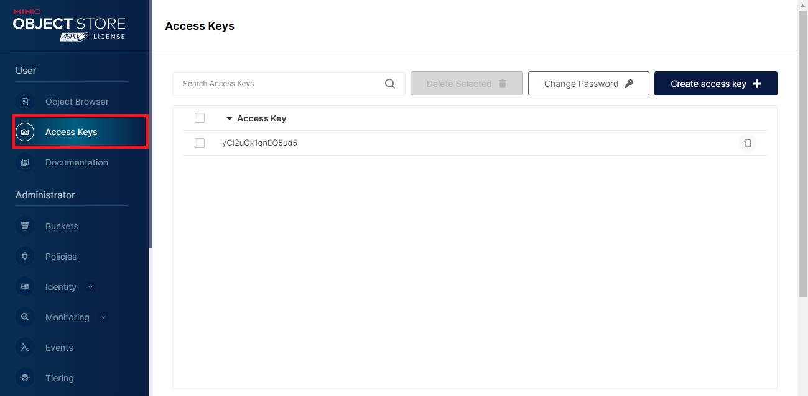
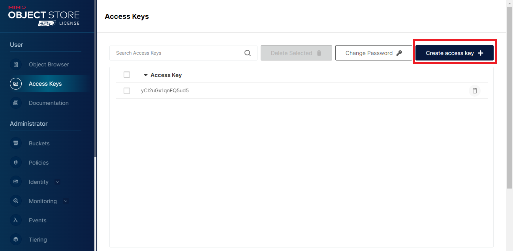
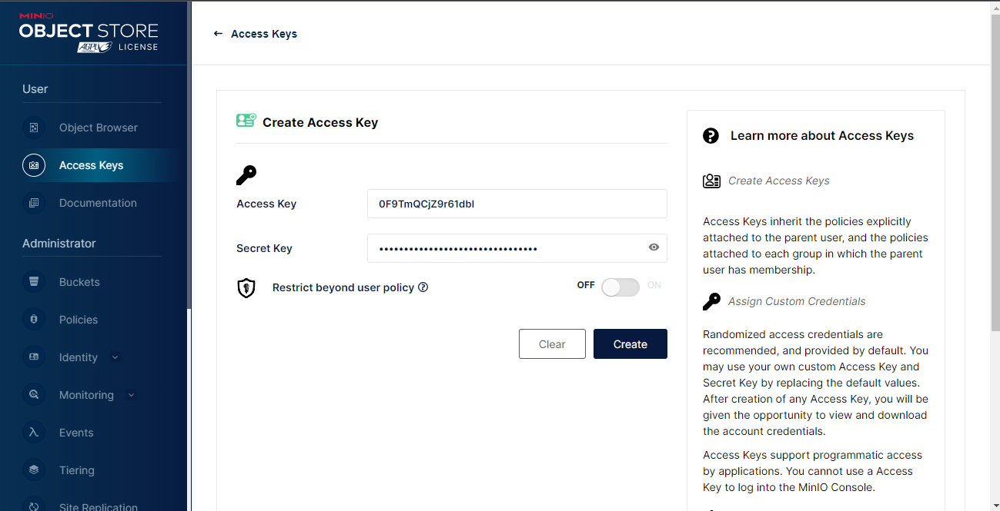
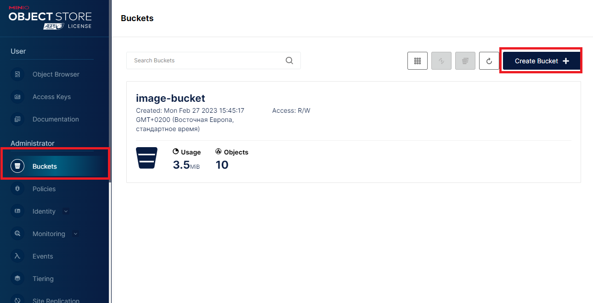
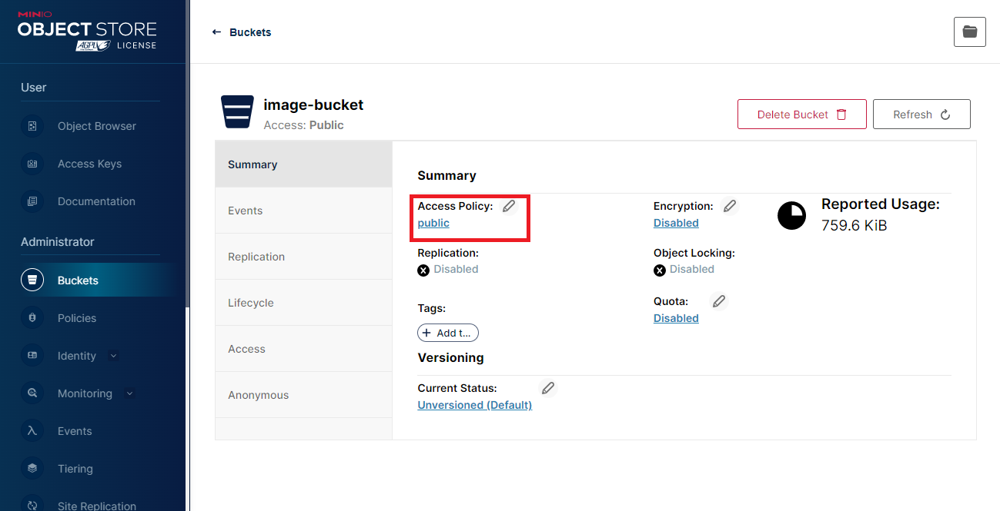

## **Description**

---

This apllication developed to show working with `MinIO` bucket and operations worked with postgres db. The FrontEnd part of the app developed on the basis of the React. Also used `RTK` for working with state, `Next.ui` for the simple design. BackEnd part based on `Nest.js + Postgres` and `Typeorm`. `MinIO` used to store files. Endpoints secured by `Passport JWT` strategy.

## **Prerequisites**

---

- node >= 14.17
- docker
- npm
- win-node-env (If you use OS Windows)

## **Run application**

---

1. `` It`s only for developing process ``: If you use OS Windows you need to install `win-node-env` package. You can do it by the following command:

   ```properties
   npm install -g win-node-env
   ```

2. Change your credential in the `.env` file. Also you can use default but it`s not secure.

3. Setup your `docker` image by `docker-compose` file, running next command:

   ```properties
   npm run services:start
   ```

4. Open a `http://localhost:9001/` url and login.

5. Create a access key. Open an `Access keys` tab:
   
   Click on `Create key` button:
   
   Create keys and copy it to `.env` file as `MINIO_ACCESS_KEY` and `MINIO_SECRET_KEY`, save this key to file.
   

6. Create a new bucket. Click on `Buckets` tab and after taht on `Create Bucket` button.
   

After this process, copy bucket name to `.env` file as `MINIO_BUCKET_NAME` vairable.
Also you need to change bucket access right to 'public' by click on the bucket.


7. Install your packages for BE part and for FE part open the `src/client` folder:

   ```properties
   npm i
   ```

8. Next step, you need to run migration for database:

   ```properties
   npm run migration:latest
   ```

9. After instalation in the `src/client` run next command:

   ```properties
   npm run build
   ```

10. In the root folder run next command for starting server:

```properties
npm run start
```

11. Now you can open `http://localhost:4000` to see the result.
